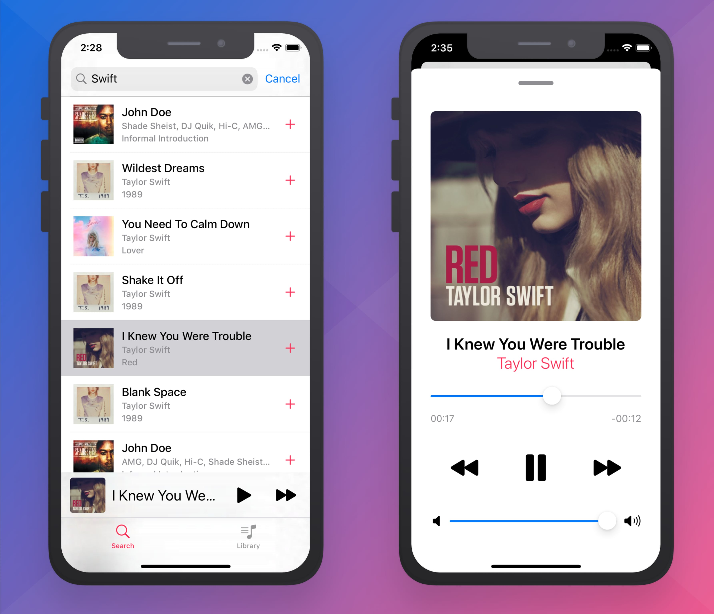
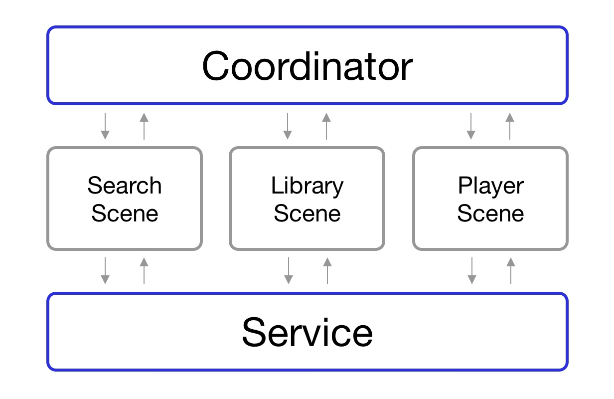

## Music App Demo
Приложение для доступа к музыкальному контенту, предоставляемому сервисом iTunes Search API. Позволяет искать preview треков в сервисе Apple Music, прослушивать полученные треки, а также сохранять понравившиеся композиции в библиотеке.

### Архитектура
Проект разработан с применением архитектурных подходов Clean Swift и Coordinator. 

Clean Swift - один из вариантов реализации "чистой" архитектуры, которую предложил Raymond Law (https://clean-swift.com/). В отличии от VIPER, где центральным компонентом модуля является Presenter, взаимодействие между основными компонентами View - Interactor - Presenter в архитектуре Clean Swift происходит циклично. Дополнительно для взаимодействия между модулями в Clean Swift применяется Router.

В качестве альтернативы применения Routers для маршрутизации и обмена данными между модулями в данном проекте используется архитектурный паттерн Coordinator. Такой подход позволяет более гибко выстраивать взаимодействие между модулями, применять модули в различных сценариях, облегчает тестирование за счет исключения зависимости между различными модулями.  

За работу с сетевыми запросами, базой данных, воспроизведением аудио вместо предлагаемых в Clean Swift Workers отвечает сервисный слой.

Таким образом, комбинация Clean Swift и Coordinator позволяет создавать хорошо структурированные, масштабируемые и тестируемые приложения. Вместо Clean Swift может быть применен любой другой вариант архитектуры модуля, например MVP или VIPER.

### О проекте

- В роли View в VIP цикле Clen Swift выступает ViewController, при этом весь код, связанный с созданием и настройкой UI элементов вынесен из ViewController в UIView  subclass. Данный подход позволяет дополнительно разгрузить Massive ViewController, а также позволяет переиспользовать View в нескольких экранах;
- Интерфейс создан без использования Storyboard. В зависимости от экрана применяются XIB файлы или UI элементы создаются программным способом;
- Приложение поддерживает новую функцию iOS 13 – темную тему (Dark Mode);
- Для воспроизведения аудио используется фремворк AVFoundation;
- Для сохранения понравившихся треков в библиотеку используется фреймворк CoreData;
- В приложении реализована анимация перехода между различными вариантами отображения плеера, имитирующая анимацию перехода приложения Apple Music;
- Приложение поддерживает функцию локализации. Доступны интерфейсы на английском и русском языке;
- Для автоматической проверки кода на соблюдение code style применяется утилита SwiftLint от Realm.

### Демо

